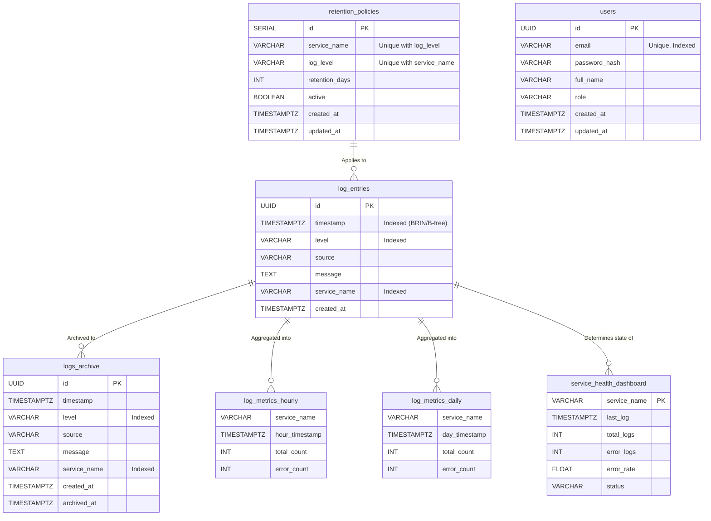

# LogStream Database & Pipeline Documentation

This document serves as the comprehensive guide to the **LogStream Observability Platform** database schemas, performance indexes, data engineering pipelines, archival strategies, and setup instructions.

---

## 1. Database Setup & Migrations

The database is built on PostgreSQL 16. The schema enforces strict data structures, provides highly optimized logging partitions, and generates pre-calculated analytical views.

### Automated Setup (Recommended)
When running the infrastructure via Docker Compose on a **fresh volume**, the database auto-initializes. 
The init sequence is executed alphabetically from `/docker-entrypoint-initdb.d/`:

1. `01_schema_ddl.sql`: Creates core tables, partitions, extensions, and users.
2. `02_analytics.sql`: Creates 13 pre-built analytical views for Metabase dashboarding.
3. `03_ensure_metabase_db.sh`: Creates the separate `metabase` database instance required for the internal BI tool.

```bash
# Start the entire stack and initialize the DB from scratch
docker-compose down -v
docker-compose up --build -d
```

### Manual Setup / Migrations
To execute setup scripts manually against an existing PostgreSQL instance:

```bash
# Run the core schema setup
psql -h localhost -p 5432 -U postgres -d logstream -f data-engineering/db/ddl/schema_ddl.sql

# Run the analytical views
psql -h localhost -p 5432 -U postgres -d logstream -f data-engineering/db/dml/analytics.sql
```

---

## 2. Entity-Relationship (ER) Diagram

The system splits raw telemetry (`log_entries`), internal user configurations (`users`, `retention_policies`), materialized aggregates (`log_metrics_*`), and historical backups (`logs_archive`).



---

## 3. Index Documentation

Performance is critical for log observability tools. The following indexes are created in `schema_ddl.sql` to support both ingestion scale and read-optimized querying.

| Index Name | Table | Columns | Type | Rationale / Expected Query |
| :--- | :--- | :--- | :--- | :--- |
| `idx_log_entries_timestamp` | `log_entries` | `timestamp` | **BRIN** | Block Range Index. Used strictly for sweeping large date ranges (e.g., `WHERE timestamp BETWEEN X AND Y`) using minimal memory overhead. |
| `idx_log_entries_level` | `log_entries` | `level` | B-Tree | Allows fast filtering of logs by severity, typically `WHERE level = 'ERROR'`. |
| `idx_log_entries_service` | `log_entries` | `service_name` | B-Tree | Fast lookup for tracking specific microservice output (`WHERE service_name = 'auth-service'`). |
| `idx_log_entries_ts_desc` | `log_entries` | `timestamp DESC` | B-Tree | Optimizes the live tail-feed: `ORDER BY timestamp DESC LIMIT 100`. |
| `idx_archive_service_ts` | `logs_archive` | `service_name, timestamp DESC` | B-Tree | Optimizes historical lookups by service and reverse chronology. |
| `idx_archive_level` | `logs_archive` | `level, timestamp DESC` | B-Tree | Optimizes historical lookups by severity level and reverse chronology. |
| `idx_users_email` | `users` | `email` | B-Tree | Optimizes authentication checks by the REST API (`WHERE email = ?`). |
| `unique_policy` | `retention_policies`| `service_name, log_level` | UNIQUE | Prevents identical configurations from overlapping or conflicting. |

---

## 4. ETL Pipeline Architecture

The ETL Pipeline (`scripts/etl_pipeline.py`) performs continuous, incremental data aggregation from the raw `log_entries` partition into decoupled `log_metrics_*` tables. This allows the Metabase dashboards to load instantaneously without repeatedly scanning millions of raw rows.

### Schedule
Tasks run automatically via `cron` inside the `logstream-data-engineering` container.
- **Hourly (:05)**: `python etl_pipeline.py --mode hourly`
- **Daily (01:00)**: `python etl_pipeline.py --mode daily`
- **Standard (15 mins)**: `python etl_pipeline.py --mode standard`

### Aggregation Logic
1. **Extraction**: Connects to postgres and selects logs matching `timestamp >= period_start` and `timestamp < period_end`.
2. **Transformation**: Uses `pandas.DataFrame.groupby` in-memory to group by `service_name`, calculating row counts and boolean sums for errors (`level == 'ERROR'`).
3. **Load**: Performs an idempotent insert. It deletes any prior data for the specific `period_start` (in case of a rerun), then `appends` the new aggregates to `log_metrics_hourly` or `log_metrics_daily`.

### Metrics Tables
- `log_metrics_hourly / daily`: Long-term historical counts of total traffic vs. error traffic.
- `service_health_dashboard`: A rolling 24-hour summary providing real-time `CRITICAL` vs `STABLE` health indicators.

---

## 5. Archival Strategy & Configuration

The Archival engine (`scripts/retention_policy.py`) runs every night at **02:00 AM**.

It fetches rules from the `retention_policies` config table. If none exist, it falls back to a global **30-day retention** default.

### Archival Workflow
When enabled, the cleanup process performs a sequential two-step archival followed by deletion:
1. **Primary Archive (DB)**: Executes `INSERT INTO logs_archive SELECT ... FROM log_entries WHERE timestamp < cutoff`.
2. **Secondary Backup (Disk)**: Pulls the same expired records via pandas and exports them to a `.csv` file in `data-engineering/archives/`.
3. **Deletion**: Deletes the expired rows from `log_entries`.

### Configuration
Controlled via `.env`:

```env
ARCHIVAL_ENABLED=true  # Set to false to merely DELETE without archiving 
```

---

## 6. Sample Queries

Here are a few common use cases you might execute against the PostgreSQL database.

**Find the highest erroring services over the last 24 hours:**
```sql
SELECT service_name, COUNT(*) as error_count 
FROM log_entries 
WHERE level = 'ERROR' 
  AND timestamp >= NOW() - INTERVAL '1 day'
GROUP BY service_name 
ORDER BY error_count DESC;
```

**Investigating a historical incident (Using the Archival Table):**
```sql
SELECT timestamp, message, level
FROM logs_archive
WHERE service_name = 'payment-service'
  AND timestamp BETWEEN '2025-01-01 09:00:00' AND '2025-01-01 11:00:00'
ORDER BY timestamp DESC;
```

**Evaluate current pipeline performance metrics:**
```sql
SELECT service_name, total_count, error_count, 
       (error_count * 100.0 / NULLIF(total_count, 0)) as error_rate
FROM log_metrics_daily
WHERE day_timestamp = CURRENT_DATE - INTERVAL '1 day'
ORDER BY error_rate DESC;
```

**Inserting a new custom retention policy:**
```sql
-- Track warning logs for 'checkout-service' for 90 days
INSERT INTO retention_policies (service_name, log_level, retention_days, active)
VALUES ('checkout-service', 'WARN', 90, true);
```
