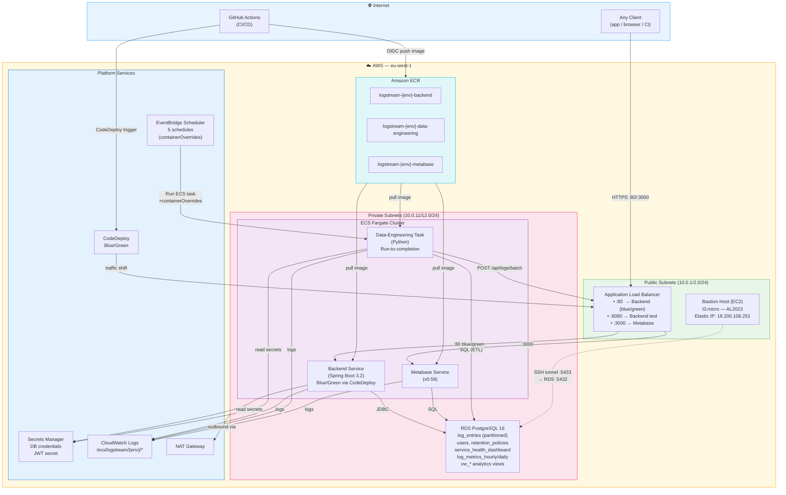

# LogStream — User Guide

A complete explanation of what LogStream is, how every piece fits together,
and exactly how data flows from generation all the way to the Metabase dashboard.

---

## Table of Contents

1. [What is LogStream?](#1-what-is-logstream)
2. [Architecture Overview](#2-architecture-overview)
3. [The Database — Schema & Partitioning](#3-the-database--schema--partitioning)
4. [The Data Generator — How Logs Are Created](#4-the-data-generator--how-logs-are-created)
5. [How Logs Enter the Database](#5-how-logs-enter-the-database)
6. [The ETL Pipeline — What It Does and When](#6-the-etl-pipeline--what-it-does-and-when)
7. [API Log Ingestion — push\_logs\_to\_api.py](#7-api-log-ingestion--push_logs_to_apipy)
8. [Analytics Views — What Metabase Reads](#8-analytics-views--what-metabase-reads)
9. [Metabase Dashboarding](#9-metabase-dashboarding)
10. [The REST API — Backend Capabilities](#10-the-rest-api--backend-capabilities)
11. [EventBridge Schedule — The Full Automation Loop](#11-eventbridge-schedule--the-full-automation-loop)
12. [Data Flow Summary (End to End)](#12-data-flow-summary-end-to-end)

---

## 1. What is LogStream?

LogStream is a **centralised log aggregation and observability platform**.

Modern applications are made up of multiple services running simultaneously — an
auth service, a payment service, an order service, and so on. Each service
continuously emits messages (logs) that describe what is happening inside it:
successful requests, warnings, errors, database queries, etc.

Without a central place to collect and analyse those logs, engineers have to SSH
into individual servers and grep through text files to diagnose problems.
LogStream solves this by:

1. **Ingesting** logs from any service via a REST API
2. **Storing** them in a structured, time-partitioned PostgreSQL table
3. **Generating & pushing** synthetic logs on a schedule via `push_logs_to_api.py`
4. **Analysing** them on a schedule using an ETL pipeline
5. **Visualising** the results in a Metabase BI dashboard

The system runs in two modes:

- **Local development** — Docker Compose brings up the database, backend API,
  data-engineering container, and Metabase in a single command.
- **AWS production** — the same services run on ECS Fargate (private subnets)
  behind an Application Load Balancer, with an RDS PostgreSQL instance, ECR
  for container images, CodeDeploy for blue/green backend deployments, and
  EventBridge Scheduler replacing the local cron daemon for all five ETL tasks.

---

## 2. Architecture Overview

### Local Development (Docker Compose)

```
┌─────────────────────────────────────────────────────────────────────┐
│                         Docker Compose                              │
│                                                                     │
│  ┌──────────────┐    REST API    ┌──────────────────────────────┐   │
│  │   Any Client │ ─────────────▶ │  Backend (Spring Boot 3.2)  │   │
│  │  (app / CLI) │                │  :8080                       │   │
│  └──────────────┘                └──────────┬───────────────────┘   │
│                                             │ JDBC                  │
│  ┌──────────────┐  direct SQL               ▼                       │
│  │  Data        │ ──────────────▶  PostgreSQL 16 :5432              │
│  │  Engineering │                  log_entries (partitioned)        │
│  │  (Python)    │ ◀─────────────   analytics views                  │
│  └──────────────┘                           ▲                       │
│                                             │ SQL                   │
│  ┌──────────────┐                           │                       │
│  │  Metabase    │ ──────────────────────────┘                       │
│  │  :3000       │                                                   │
│  └──────────────┘                                                   │
└─────────────────────────────────────────────────────────────────────┘
```

### AWS Production Architecture



### Key Networking Rules

| Path | Allowed | Notes |
|---|---|---|
| Internet → ALB | ✅ | Ports 80, 8080, 3000 |
| ALB → Backend ECS | ✅ | Port 8080 (backend SG) |
| ALB → Metabase ECS | ✅ | Port 3000 (metabase SG) |
| ECS → RDS | ✅ | Port 5432 (backend + DE + metabase SGs) |
| ECS → Internet | ✅ | Via NAT Gateway (pull packages, call APIs) |
| Bastion → RDS | ✅ | Port 5432 (bastion SG ingress rule) |
| Internet → RDS | ❌ | No public access — private subnets only |
| Internet → ECS | ❌ | All traffic must enter through the ALB |

### CI/CD Flow

```
Developer → git push → GitHub Actions
  1. Build Docker image
  2. Push to ECR (logstream-{env}-backend)
  3. Register new ECS task definition revision
  4. Trigger CodeDeploy blue/green deployment
     └── Shifts traffic: ALB port-80 listener blue TG → green TG
         (ALB listeners have ignore_changes = [default_action]
          so Terraform never reverts CodeDeploy's routing)
```

---

## 3. The Database — Schema & Partitioning

### Tables

**`log_entries`** — the core table. Every log that enters the system lives here.

```sql
CREATE TABLE log_entries (
    id           UUID DEFAULT gen_random_uuid(),
    timestamp    TIMESTAMPTZ NOT NULL,      -- when the event happened
    level        VARCHAR(10) NOT NULL,      -- TRACE | DEBUG | INFO | WARN | ERROR
    source       VARCHAR(100),              -- the service that emitted the log
    message      TEXT NOT NULL,             -- the human-readable log message
    service_name VARCHAR(100) NOT NULL,     -- used for grouping in analytics
    created_at   TIMESTAMPTZ DEFAULT NOW(), -- when the record was inserted
    PRIMARY KEY (timestamp, id)
) PARTITION BY RANGE (timestamp);
```

**`users`** — accounts used by the REST API. Passwords are stored as bcrypt
hashes. Email uses the `citext` extension so `Admin@example.com` and
`admin@example.com` are treated as the same address.

**`retention_policies`** — rules that define how many days to keep logs for
each service or log level combination. The retention script reads this table
and deletes (or archives) logs that have exceeded their allowed age.

**`logs_archive`** — expired logs are moved here instead of being deleted
outright when archival mode is enabled.

**ETL-produced tables** (created by the pipeline at runtime):

| Table | Created by | Purpose |
|---|---|---|
| `service_health_dashboard` | ETL standard run | Per-service health snapshot (error rate, status) |
| `log_metrics_hourly` | ETL hourly run | Aggregated counts per service per hour |
| `log_metrics_daily` | ETL daily run | Aggregated counts per service per day |

### Why Partitioning?

`log_entries` is partitioned **by range on `timestamp`**, one partition per
calendar day (e.g. `log_entries_y2026_03_12`). A default catch-all partition
handles any data that doesn't fit a named partition.

This matters at scale because:
- PostgreSQL can **prune** partitions during a query — if you ask for logs from
  March 12, the planner skips every other day's partition entirely
- Old partitions can be **dropped** in milliseconds instead of running a slow
  `DELETE` across millions of rows
- Inserts stay fast because each partition is smaller

The ETL pipeline creates today's and tomorrow's partitions proactively on
every standard run, so there is never a partition-miss on insert.

### Indexes

| Index | Type | Used for |
|---|---|---|
| `idx_logs_search_lookup` | B-Tree on `(service_name, level, timestamp DESC)` | Search endpoint — filter by service + level within a time range |
| `idx_logs_volume_brin` | BRIN on `timestamp` | Volume aggregations over large time ranges — tiny on disk |
| `idx_users_email` | B-Tree on `email` | Login lookups via `WHERE email = ?` |
| `idx_archive_service_ts` | B-Tree on `(service_name, timestamp DESC)` | Archive queries |

---

## 4. The Data Generator — How Logs Are Created

File: `data-engineering/scripts/data_generator.py`  
Config: `data-engineering/config/config.py`

The generator creates **realistic-looking synthetic log data** and writes it
either to a JSON file or directly to the database. It is the tool used to
seed the system with historical data for testing and demo purposes.

### 4.1 Services Modelled

Five services are configured in `config.py`, each with a baseline error rate:

| Service | Baseline error rate |
|---|---|
| `auth-service` | 5% |
| `payment-service` | 15% |
| `order-service` | 8% |
| `notification-service` | 3% |
| `api-gateway` | 2% |

### 4.2 Log Levels and Baseline Weights

Every log gets a level. The default distribution across the whole system is:

| Level | Weight | Meaning |
|---|---|---|
| INFO | 60% | Normal operation |
| DEBUG | 20% | Diagnostic detail |
| WARN | 10% | Something looks off |
| ERROR | 8% | Something broke |
| TRACE | 2% | Deepest detail (method entry/exit) |

Each service gets its own adjusted weights so that `payment-service` (15%
error rate) generates more ERRORs than `api-gateway` (2% error rate) **even
in normal periods**, not just during spikes.

### 4.3 Business-Hours Timestamp Weighting

Real systems don't generate logs at a constant rate through the night.
The generator models this with 24 per-hour weights in `_HOUR_WEIGHTS`:

```
00-05  quiet overnight  (weight: 0.2–0.5)
06-11  morning ramp-up  (weight: 0.8–2.5)
12-17  core business    (weight: 2.0–2.5)
18-23  evening decline  (weight: 0.6–1.5)
```

For each candidate timestamp, a random value is drawn and accepted with
probability proportional to that hour's weight. This produces a realistic
intraday volume curve.

### 4.4 Error Spikes — Pre-Placed Windows

This is the most important generator concept. Rather than deciding per-log
"should this be an error?", the generator **pre-places concrete datetime
windows** before any log is generated.

Two services have spike config:

```python
ERROR_SPIKES = {
    "payment-service": {
        "num_spikes":       2,       # 2 separate spike windows
        "duration_minutes": 20,      # each lasts 20 minutes
        "error_weight":     0.65,    # 65% of logs are ERROR during the spike
    },
    "order-service": {
        "num_spikes":       1,
        "duration_minutes": 15,
        "error_weight":     0.55,
    },
}
```

`_build_spike_windows()` runs once at the start and returns a dict like:

```python
{
  "payment-service": [
      (datetime(2026,3,1,10,23), datetime(2026,3,1,10,43)),  # spike 1
      (datetime(2026,3,5,14,07), datetime(2026,3,5,14,27)),  # spike 2
  ],
  ...
}
```

Then, for every log, `_in_window()` checks whether the log's timestamp falls
inside any of that service's spike windows. If it does, the normal level
weights are swapped for the spike weights (65% ERROR). If not, the service's
baseline weights are used.

This guarantees that when you plot error rate over time in Metabase, you see
**real visible spikes** in a coherent 20-minute window — not random noise.

### 4.5 Service Outages — Simulated Silence

Two services are configured with outage windows:

```python
SERVICE_OUTAGES = {
    "notification-service": {"num_outages": 1, "duration_minutes": 30},
    "auth-service":         {"num_outages": 1, "duration_minutes": 25},
}
```

`_build_outage_windows()` works the same way as spike windows but instead of
changing the log level, the generator **drops the log entirely** (returns
`None`) if the timestamp falls inside an outage window. The service simply
goes silent for that period, which is what you'd expect if a service crashed.

This is visible in Metabase's `vw_silent_services` view as an unexpected gap.

### 4.6 Message Templates

Each level has a bank of realistic message templates in `MESSAGE_MAP`. The
`{n}` placeholder is replaced at generation time with a random integer:

```python
ERROR_MESSAGES = [
    "Database connection timeout after {n}ms",
    "JWT token expired for user session {n}",
    "Payment gateway unavailable — retry {n} of 3",
    "NullPointerException in OrderProcessor.validate() line {n}",
    "Circuit breaker OPEN after {n} consecutive failures",
    ...
]
```

### 4.7 The Generation Loop

```python
def generate_logs(services, num_logs=5000, days=30):
    end_time   = now(UTC)
    start_time = end_time - timedelta(days=days)

    # Step 1 — pre-place all windows (done ONCE, before any log is touched)
    spike_windows  = _build_spike_windows(start_time, end_time)
    outage_windows = _build_outage_windows(start_time, end_time)

    logs = []
    max_attempts = num_logs * 3  # headroom to absorb outage drops

    # Step 2 — main loop
    while len(logs) < num_logs and attempts < max_attempts:
        service = random.choice(services)          # pick a service
        ts      = _realistic_timestamp(...)        # pick a weighted timestamp
        log     = generate_log(service, ts, ...)   # build the record (or None)
        if log:
            logs.append(log)

    # Step 3 — sort chronologically and return
    logs.sort(key=lambda x: x["timestamp"])
    return logs
```

The 3x attempt buffer ensures outage windows (which silently drop logs) don't
cause the output to fall short of the requested count.

### 4.8 Output Format

Each generated record is a Python dict matching the `log_entries` schema exactly:

```json
{
  "id":           "3f2a1b4c-...",
  "timestamp":    "2026-03-10T14:23:01.000+00:00",
  "level":        "ERROR",
  "source":       "payment-service",
  "message":      "Payment gateway unavailable — retry 2 of 3",
  "service_name": "payment-service",
  "created_at":   "2026-03-10T14:23:01.000+00:00"
}
```

When run as a CLI tool, logs are saved to
`data-engineering/data/logs_YYYYMMDD_HHMMSS.json`.

---

## 5. How Logs Enter the Database

There are two paths:

### Path A — Via the Backend REST API (production path)

Any application (or `push_logs_to_api.py`, see Section 7) sends an HTTP `POST`
to the backend. In AWS production the entry point is the **ALB DNS name** — the
request routes through the load balancer to one of the backend ECS tasks:

```
POST /api/logs
Authorization: Bearer <jwt-token>
Content-Type: application/json

{
  "timestamp":   "2026-03-12T10:00:00Z",
  "level":       "ERROR",
  "source":      "payment-service",
  "message":     "Payment gateway unavailable",
  "service_name":"payment-service"
}
```

The backend validates the payload, assigns a UUID, and persists it via Spring
Data JPA into the `log_entries` partitioned table. PostgreSQL routes the row
into the correct daily partition automatically based on the `timestamp` value.

**Batch ingestion** is also supported:

```
POST /api/logs/batch
```
Accepts an array of log entries and inserts them all in one transaction. This
is the endpoint used by `push_logs_to_api.py` — the data-engineering container
generates synthetic logs and `POST`s them here via the internal ALB URL:
```
API_URL_BATCH=http://logstream-dev-alb-78023209.eu-west-1.elb.amazonaws.com/api/logs/batch
```

**CSV/JSON file import** is supported too:

```
POST /api/logs/import   (multipart/form-data, field: "file")
```

### Path B — Direct Database Insert (data generator + ETL)

The ETL pipeline scripts (`etl_pipeline.py`, `retention_policy.py`) connect
directly to PostgreSQL via SQLAlchemy using credentials injected from AWS
Secrets Manager into the ECS task environment. They bypass the REST API and
write rows straight into `log_entries`. This is appropriate for bulk seeding
and internal pipeline aggregation operations.

---

## 6. The ETL Pipeline — What It Does and When

File: `data-engineering/scripts/etl_pipeline.py`

The ETL pipeline has **three run modes**, each triggered by cron at different
intervals. Here is exactly what happens in each.

### Mode 1 — `standard` (every 15 minutes)

This is the heartbeat of the system. It runs two tasks:

**Task 1: Partition management**

```python
def manage_partitions():
    today    = utcnow().date()
    tomorrow = today + timedelta(days=1)
    _create_partition(conn, today)     # CREATE TABLE IF NOT EXISTS log_entries_y2026_03_12
    _create_partition(conn, tomorrow)  # CREATE TABLE IF NOT EXISTS log_entries_y2026_03_13
```

PostgreSQL's partitioned tables need a child table to exist for each date
range before rows can land there. The pipeline creates today's and tomorrow's
partitions proactively so there is never a moment where an insert would fail
because no matching partition exists.

**Task 2: Service health dashboard refresh**

```python
# Extract the last 24 hours of logs
health_logs_df = extract_incremental_logs(minutes=1440)

# Calculate per-service metrics
health_df = transform_health_metrics(health_logs_df)
# health_df columns: service_name, last_log, total_logs, error_logs, error_rate, status

# Truncate old data and reload
TRUNCATE TABLE service_health_dashboard;
load_data(health_df, "service_health_dashboard")
```

`transform_health_metrics()` groups by `service_name` and computes:
- `last_log` — the timestamp of the most recent log from that service
- `total_logs` — how many logs in the last 24 hours
- `error_logs` — how many were `ERROR` level
- `error_rate` — `error_logs / total_logs * 100`
- `status` — `CRITICAL` if error rate > 15%, otherwise `STABLE`

The result is a fresh snapshot of every service's health, refreshed every
15 minutes.

### Mode 2 — `hourly` (every hour at :05)

```python
def run_aggregation(mode="hourly"):
    # Calculate the previous complete hour
    period_start = (now - timedelta(hours=1)).replace(minute=0, second=0)
    period_end   = period_start + timedelta(hours=1)

    # Extract logs for that exact hour
    logs_df = extract_logs(period_start, period_end)

    # Aggregate counts per service
    metrics_df = aggregate_metrics(logs_df, period_start, "hour")
    # metrics_df columns: service_name, total_count, error_count, hour_timestamp

    # Idempotent write — delete existing row for this period_start before inserting
    DELETE FROM log_metrics_hourly WHERE hour_timestamp = period_start;
    load_data(metrics_df, "log_metrics_hourly")
```

This creates a permanent, compact record of what happened in each hour.
Because the write is **idempotent** (delete-then-insert), re-running the
pipeline for the same hour is safe and produces no duplicates.

### Mode 3 — `daily` (every day at 1:00 AM)

Identical logic to hourly but covers the previous full calendar day and
writes to `log_metrics_daily`:

```
DELETE FROM log_metrics_daily WHERE day_timestamp = yesterday_start;
INSERT INTO log_metrics_daily ...
```

---

## 7. API Log Ingestion — push\_logs\_to\_api.py

File: `data-engineering/scripts/push_logs_to_api.py`

This script is the **bridge between the data generator and the backend API**.
Rather than inserting logs directly into the database, it generates synthetic
logs and pushes them to the system via the standard REST batch endpoint —
exactly as a real external service would.

### Why it exists

Direct DB inserts (Path B above) are used internally by the ETL pipeline for
aggregation writes. `push_logs_to_api.py` tests and exercises the **full
ingestion path** end-to-end: generator → HTTP → ALB → Spring Boot → JPA →
RDS. This ensures the API, authentication, and partition routing all work
correctly under load.

### How it works

```python
# Environment variable set in the ECS task definition via Terraform
API_URL_BATCH = os.getenv("API_URL_BATCH")
#   → http://logstream-dev-alb-78023209.eu-west-1.elb.amazonaws.com/api/logs/batch

BATCH_SIZE = 500   # logs per HTTP request

# Flow:
# 1. generate_logs()   — produces synthetic log records using data_generator.py
# 2. transform_log()   — maps generator schema → API schema (serviceName, level, message, source)
# 3. chunk_list()      — splits into 500-log batches
# 4. POST /api/logs/batch — sends each batch to the ALB endpoint
```

### Environment configuration

| Variable | Value (dev) | Set by |
|---|---|---|
| `API_URL_BATCH` | `http://logstream-dev-alb-78023209.eu-west-1.elb.amazonaws.com/api/logs/batch` | ECS task definition (`ecs/main.tf`) |

In the ECS task definition this is configured as a plain environment variable
(not a secret) because the ALB DNS name is not sensitive:

```hcl
environment = [
  ...
  { name = "API_URL_BATCH", value = var.api_url_batch },
]
```

### Schedule

EventBridge triggers this script **every hour at :00 UTC** (see Section 11).
The data-engineering container starts, runs the script, and exits cleanly —
no persistent process required.

---

## 8. Analytics Views — What Metabase Reads

File: `data-engineering/db/dml/analytics.sql`

These are PostgreSQL **views** — they are not tables with stored data. Every
time Metabase runs a dashboard panel that references a view, PostgreSQL runs
the query live against `log_entries`. This means the dashboard always
reflects the current state of the data with no manual refresh needed.

All views are created once at database initialisation and can be updated at
any time with `CREATE OR REPLACE VIEW`.

### The 17 Views

| View | Panel type | What it answers |
|---|---|---|
| `vw_error_rate_24h` | Bar chart | Which services had the highest error rate in the last 24 hours? |
| `vw_warn_rate_24h` | Bar chart | Which services had the highest warning rate in the last 24 hours? |
| `vw_common_errors_top10` | Table | What are the 10 most repeated error messages in the last 30 days? |
| `vw_volume_trends_hourly` | Line chart | How many logs per hour per service in the last 7 days? |
| `vw_volume_trends_daily` | Area chart | How many logs per day per service in the last 30 days? |
| `vw_level_distribution` | Stacked bar | What % of each service's logs are INFO vs WARN vs ERROR? |
| `vw_activity_heatmap` | Heatmap | Which hours of which days are the busiest for each service? |
| `vw_error_spike_detection` | Table (conditional formatting) | Which services are experiencing errors above their own baseline right now? |
| `vw_silent_services` | Alert table | Which services have stopped emitting logs (possible crash)? |
| `vw_top_noisy_services` | Pie / bar chart | Which services are generating the most log volume in the last 24 hours? |
| `vw_service_health_dashboard` | Health table | Single-glance status per service (HEALTHY / DEGRADED / CRITICAL) |
| `vw_recent_critical_events` | Live feed table | Last 50 ERROR-level logs across all services |
| `vw_mtbe_per_service` | Bar chart | Mean time between errors per service (reliability metric — higher is better) |
| `vw_total_events_24h` | Scalar KPI | Total log count in the last 24 hours |
| `vw_total_warnings_24h` | Scalar KPI | Total warning count in the last 24 hours |
| `vw_total_errors_24h` | Scalar KPI | Total error count in the last 24 hours |
| `vw_total_services` | Scalar KPI | How many distinct services are currently reporting |
| `vw_overall_error_rate_24h` | Scalar KPI | System-wide error rate in the last 24 hours |

### Example — Error Spike Detection (`vw_error_spike_detection`)

This view is more complex and worth understanding in detail. It answers:
*"Is this service behaving worse than its own recent history?"*

```sql
WITH baseline AS (
    -- Calculate the 7-day average daily error count for each service
    SELECT service_name,
           AVG(daily_errors) AS avg_daily_errors_7d
    FROM (
        SELECT service_name,
               DATE_TRUNC('day', timestamp) AS day,
               COUNT(*) FILTER (WHERE level = 'ERROR') AS daily_errors
        FROM log_entries
        WHERE timestamp >= NOW() - INTERVAL '7 days'
        GROUP BY service_name, day
    ) daily
    GROUP BY service_name
),
current_window AS (
    -- Count errors in just the last 1 hour
    SELECT service_name,
           COUNT(*) FILTER (WHERE level = 'ERROR') AS errors_last_1h
    FROM log_entries
    WHERE timestamp >= NOW() - INTERVAL '1 hour'
    GROUP BY service_name
)
SELECT
    b.service_name,
    b.avg_daily_errors_7d,
    c.errors_last_1h,
    -- Annualise the 1-hour rate and compare to the daily average
    (c.errors_last_1h * 24.0) / b.avg_daily_errors_7d AS spike_ratio,
    CASE
        WHEN spike_ratio > 3   THEN 'CRITICAL'
        WHEN spike_ratio > 1.5 THEN 'ELEVATED'
        ELSE                        'NORMAL'
    END AS spike_status
FROM baseline b LEFT JOIN current_window c USING (service_name)
```

A `spike_ratio` of 2 means the service is currently generating errors at
twice its 7-day average daily rate. This catches payment-service's
pre-placed error spikes in near-real time.

---

## 9. Metabase Dashboarding

Metabase is the business intelligence layer. It connects directly to
PostgreSQL and queries the `vw_*` views like regular tables.

### First-Time Setup

**Local (Docker Compose)** — access at `http://localhost:3000`

**AWS production** — access at `http://logstream-dev-alb-78023209.eu-west-1.elb.amazonaws.com:3000`

On first access, complete the setup wizard. When prompted to add a database, enter:

| Field | Local value | AWS value |
|---|---|---|
| Host | `postgres` (Docker network hostname) | RDS endpoint (from `terraform output rds_endpoint`) |
| Port | `5432` | `5432` |
| Database | value of `DB_NAME` | `logstream_db` |
| Username | `DB_USERNAME` from `.env` | from Secrets Manager (`logstream/dev/db-credentials`) |
| Password | `DB_PASSWORD` from `.env` | from Secrets Manager (`logstream/dev/db-credentials`) |

> **AWS tip**: Metabase connects from inside the VPC so it reaches the RDS
> private endpoint directly. No bastion or tunnel is needed — Metabase's ECS
> task is in the same private subnet as RDS, and its security group has port
> 5432 inbound allowed from the `metabase` SG.

Metabase discovers all views and tables automatically after the connection
is saved.

### How the Dashboard Works

Each Metabase "question" (panel) is a query against one of the views.
Because the views run live against `log_entries`, there is no stale cache —
Metabase always shows current data.

The `vw_service_health_dashboard` view produces a row per service with a
computed `status` column:

| service_name | last_log_at | total_logs_24h | error_rate_24h | status |
|---|---|---|---|---|
| payment-service | 2026-03-12 14:22 | 1843 | 18.4% | CRITICAL |
| auth-service | 2026-03-12 14:21 | 924 | 6.1% | HEALTHY |
| order-service | 2026-03-12 13:59 | 712 | 11.3% | DEGRADED |

Metabase can apply conditional row colouring so that CRITICAL rows appear red
and HEALTHY rows appear green, giving on-call engineers an at-a-glance view.

### Why the ETL Tables Exist Alongside the Views

The views recalculate everything on each load. For scalar KPIs and real-time
feeds this is fine — the queries are fast. But some operations (trend analysis
over 30 days, spike detection) scan large volumes of data. The ETL pipeline's
`log_metrics_hourly` and `log_metrics_daily` tables pre-aggregate the raw data
on a schedule, so a Metabase panel querying 30 days of hourly counts reads
from a small derived table instead of scanning millions of raw log rows.

---

## 10. The REST API — Backend Capabilities

Base URL (local): `http://localhost:8080`  
API Documentation: `http://localhost:8080/swagger-ui/index.html`

All endpoints except `/api/auth/**`, `/swagger-ui/**`, and `/actuator/health`
require a JWT bearer token in the `Authorization` header.

### Authentication

| Method | Endpoint | Description |
|---|---|---|
| `POST` | `/api/auth/register` | Create a new user account |
| `POST` | `/api/auth/login` | Get a JWT token |

### Log Ingestion

| Method | Endpoint | Description |
|---|---|---|
| `POST` | `/api/logs` | Ingest a single log entry |
| `GET` | `/api/logs?page=0&size=20` | Paginated list of all logs |
| `POST` | `/api/logs/batch` | Ingest multiple log entries in one request |
| `POST` | `/api/logs/import` | Upload a CSV or JSON file of logs |
| `POST` | `/api/logs/search` | Search logs with filters (service, level, time range, keyword) |

### Analytics

| Method | Endpoint | Description |
|---|---|---|
| `GET` | `/api/analytics/error-rate` | Error rate per service (last 24h) |
| `GET` | `/api/analytics/common-errors?service=X` | Top repeated error messages for a service |
| `GET` | `/api/analytics/volume?service=X&granularity=hour` | Log volume time series (hourly or daily) |

### Retention

| Method | Endpoint | Description |
|---|---|---|
| `GET` | `/api/retention` | List all retention policies |
| `POST` | `/api/retention` | Create a new retention policy |
| `PUT` | `/api/retention/{id}` | Update a policy |
| `DELETE` | `/api/retention/{id}` | Delete a policy |

---

## 11. EventBridge Schedule — The Full Automation Loop

In the AWS deployment, the `data-engineering` container no longer runs a
persistent cron daemon. Instead, **AWS EventBridge Scheduler** launches a
fresh ECS Fargate task for each job on its own schedule, injects the specific
Python command via `containerOverrides`, and the container executes that
command and exits cleanly.

This approach is more reliable than an in-container cron because:
- Each invocation is a fresh isolated container (no state pollution)
- EventBridge retries failed invocations automatically (up to 2 attempts)
- CloudWatch captures logs per invocation with a clear stream prefix
- No risk of the container crashing and silently killing all scheduled jobs

### The 5 Schedules

| Schedule Name | Command | Frequency | UTC Time |
|---|---|---|---|
| `etl-15min` | `etl_pipeline.py --mode standard` | Every 15 minutes | N/A |
| `aggregate-hourly` | `etl_pipeline.py --mode hourly` | Every hour | :05 |
| `push-logs-to-api` | `push_logs_to_api.py` | Every hour | :00 |
| `aggregate-daily` | `etl_pipeline.py --mode daily` | Every day | 01:00 |
| `retention-policy` | `retention_policy.py` | Every day | 02:00 |

### How EventBridge passes the command

Each EventBridge target fires with an `input` JSON payload that overrides the
container's default command at runtime:

```json
{
  "containerOverrides": [{
    "name": "data-engineering",
    "command": ["python", "/app/scripts/etl_pipeline.py", "--mode", "standard"]
  }]
}
```

Terraform manages all five schedules in
`devops/terraform/modules/eventbridge/main.tf` using a `for_each` map.

### Ordering rationale

The daily aggregation runs at **01:00** and the retention policy at **02:00**.
This guarantees that every log from the previous day is counted into
`log_metrics_daily` before the retention script deletes expired rows.

---

## 12. Data Flow Summary (End to End)

```
Step 1 — Log Emission
  ─────────────────────────────────────────────────────────────────
  An application (or push_logs_to_api.py) creates a log record:
  {id, timestamp, level, source, message, service_name, created_at}

Step 2 — Ingestion
  ─────────────────────────────────────────────────────────────────
  Via REST API (production path):
    POST /api/logs/batch  →  ALB  →  Backend ECS (Spring Boot)
    Backend validates + saves via JPA

  Via direct SQL (ETL pipeline internal):
    INSERT INTO log_entries  (ETL writes aggregation results)

  PostgreSQL routes the row to the correct daily partition:
    timestamp 2026-03-12  →  log_entries_y2026_03_12

Step 3 — Data sits in log_entries
  ─────────────────────────────────────────────────────────────────
  Raw log rows accumulate in the partitioned table.
  Analytics views (vw_*) query this table live and always see
  the latest data without any pipeline involvement.

Step 4 — EventBridge fires scheduled ECS tasks
  ─────────────────────────────────────────────────────────────────
  Every 15 min (etl-15min / standard):
    EventBridge → new Fargate task (containerOverrides: --mode standard)
    • Creates today's + tomorrow's partitions (if missing)
    • Reads last 24h of log_entries
    • Computes per-service error_rate, status
    • Writes → service_health_dashboard (truncate + reload)
    Task exits cleanly.

  Every hour at :00 (push-logs-to-api):
    EventBridge → new Fargate task (containerOverrides: push_logs_to_api.py)
    • Generates synthetic logs via data_generator.py
    • POSTs in 500-log batches → ALB → /api/logs/batch → RDS
    Task exits cleanly.

  Every hour at :05 (aggregate-hourly):
    EventBridge → new Fargate task (containerOverrides: --mode hourly)
    • Reads the previous complete hour from log_entries
    • Groups by service → total_count, error_count
    • Writes → log_metrics_hourly (idempotent delete-then-insert)
    Task exits cleanly.

  Every day at 01:00 (aggregate-daily):
    EventBridge → new Fargate task (containerOverrides: --mode daily)
    • Reads the previous complete day from log_entries
    • Groups by service → total_count, error_count
    • Writes → log_metrics_daily (idempotent)
    Task exits cleanly.

  Every day at 02:00 (retention-policy):
    EventBridge → new Fargate task (containerOverrides: retention_policy.py)
    • Reads retention_policies table
    • Deletes (or archives) logs older than their policy allows
    • Drops empty old partitions
    Task exits cleanly.

Step 5 — Metabase Queries
  ─────────────────────────────────────────────────────────────────
  Metabase (ECS Fargate, private subnet, :3000 via ALB) queries
  the PostgreSQL vw_* views live against log_entries.

  For panels showing aggregated trends:
  Metabase queries log_metrics_hourly / log_metrics_daily
  (pre-computed by ETL) instead of scanning raw log_entries.

Step 6 — Engineer reads the dashboard
  ─────────────────────────────────────────────────────────────────
  • KPI cards: total events, errors, warnings, services live
  • vw_error_spike_detection: is any service above its baseline?
  • vw_service_health_dashboard: which services are CRITICAL?
  • vw_recent_critical_events: what are the last 50 errors?
  • vw_silent_services: has any service gone quiet unexpectedly?
  • vw_activity_heatmap: what time of day is the system busiest?

Step 7 — On-call access to raw data (AWS only)
  ─────────────────────────────────────────────────────────────────
  SSH tunnel via Bastion Host (EC2, Elastic IP: 18.200.108.251):
    ssh -i ~/.ssh/logstream-bastion \
        -L 5433:<rds-endpoint>:5432 \
        -N -f ec2-user@18.200.108.251

  Connect DBeaver / psql to localhost:5433
  → Reaches RDS in private subnet without exposing it to the internet.
```
